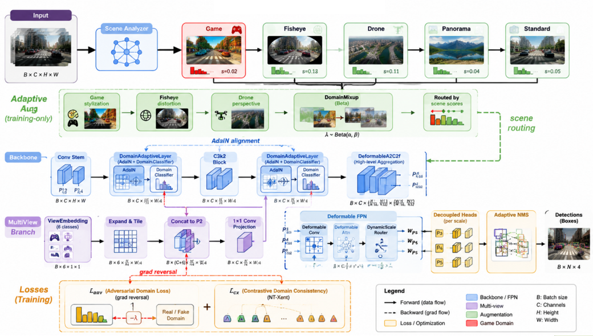

# YOLOv14

## Unified Cross-Domain Real-Time Object Detection

**YOLOv14** is a real-time object detection framework designed for **non-ideal imaging conditions** that standard detectors fail on:

| Scenario | Standard Detectors | YOLOv14 |
|----------|-------------------|---------|
| **Fisheye / wide-angle** | Misses objects near edges | Deformable Area-Attention warps the feature grid to compensate for distortion |
| **Game characters** (Delta Force, COD, PUBG) | Fail to detect as "person" | Game2Real domain adaptation aligns game/real feature distributions |
| **Drone / top-down view** | Poor small-object detection | Multi-View Conditioning + DynamicScaleRouter adapt to aerial perspectives |
| **360° panoramas** | Boundary discontinuity, latitude distortion | Spherical Attention + CircularConv handle equirectangular projection |
| **Mixed camera sources** | Single model can't handle all | Adaptive Augmentation auto-selects per-scene strategy |

Unlike conventional YOLO variants that assume ideal pinhole-camera input, YOLOv14 learns **domain-invariant, viewpoint-robust features** through a combination of deformable attention, adaptive instance normalization, and adversarial domain alignment.

---

## System Pipeline



The pipeline consists of six stages:

1. **Scene Analysis** — lightweight heuristics classify the input scene type (game, fisheye, drone, panorama, standard)
2. **Adaptive Augmentation** (training only) — scene-routed augmentation branches (game stylization, fisheye distortion, perspective transform, domain mixup)
3. **Domain Adaptation** — DomainAdaptiveLayer with AdaIN aligns game→real feature statistics; DomainAdversarialLoss drives domain-invariant learning via gradient reversal
4. **Multi-View Conditioning** — ViewEmbedding injects a learned 6-class viewpoint embedding (pinhole, fisheye, panoramic, drone, BEV, ground)
5. **Deformable Feature Pyramid** — Deformable Area-Attention + DynamicScaleRouter adapts sampling locations and scale weights per input
6. **Detection Heads** — decoupled P3/P4/P5 heads with adaptive NMS

---

## Architecture

```
Input → Scene Analysis → DomainAdaptiveLayer → ViewEmbedding →
DeformableA2C2f (×N) → DynamicScaleRouter → Detect(P3/P4/P5)
```

### Deformable Area-Attention (D-AAttn)

Replaces standard area-attention with a learnable 2D deformation field. The offset predictor warps the feature grid before computing attention, allowing the model to adapt to local geometric distortions.

| Module | Description |
|--------|-------------|
| `DeformableConv` | Dense warp-then-convolve; predicts per-pixel offset field |
| `DeformableAAttn` | Area-attention computed on a deformed grid |
| `DeformableA2C2f` | R-ELAN block with deformable ABlocks |

### Game2Real Domain Adaptation

Three complementary mechanisms bridging the game-rendering domain to the photographic domain:

- **Data-level:** `GameCharacterStylization` applies posterization, edge sharpening, saturation boost, contrast adjustment, and unsharp masking to real images, simulating game engine rendering.
- **Feature-level:** `DomainAdaptiveLayer` uses Adaptive Instance Normalization (AdaIN) to shift game-domain feature statistics toward the real-domain distribution.
- **Objective-level:** `DomainAdversarialLoss` pits a domain classifier against the feature extractor in a minimax game, producing domain-invariant representations.

### Adaptive Augmentation Policy

Rather than applying fixed transforms uniformly, `AdaptiveAugmentPolicy` analyzes each input via edge density, saturation mean, and contrast variance heuristics, then selects the optimal augmentation branch.

### Multi-View Conditioning

`ViewEmbedding` injects a learned 6-class embedding (pinhole=0, fisheye=1, panoramic=2, drone=3, bev=4, ground=5) into backbone features via concatenation and 1×1 projection. `CrossViewConsistencyLoss` (NT-Xent contrastive) pulls same-class features from different views closer in embedding space.

### Adaptive Resolution Pyramid

`DynamicScaleRouter` is a lightweight gating network that learns per-input scale importance weights for P3/P4/P5. Drone views emphasize P3 (small objects); BEV/satellite views balance all scales.

### Spherical Attention

`SphereAAttn` partitions the feature map into latitude bands for spherical-aware attention on equirectangular panoramas. `CircularConv` applies wrap-around horizontal padding to maintain boundary continuity at 0°/360°.

---

## Model Variants

| Variant | Key Modules | Target Scenario |
|---------|-------------|-----------------|
| Standard | A2C2f | Regular pinhole images |
| Deformable | DeformableA2C2f | Fisheye / wide-angle |
| MultiView | ViewEmbedding + CrossViewLoss | Drone / BEV / mixed perspectives |
| Panorama | SphereAAttn + CircularConv | 360° equirectangular |
| Game2Real | DomainAdaptiveLayer + DomainAdvLoss | Game character detection |
| Adaptive | All components combined | Universal — auto scene detection |

---

## Quick Start

```bash
conda create -n yolov14 python=3.11 supervision flash-attn
conda activate yolov14
pip install -r requirements.txt
pip install -e .
```

**Train Game2Real model:**
```python
from ultralytics import YOLO
model = YOLO("ultralytics/cfg/models/v14/yolov14-game2real.yaml")
model.train(data="coco.yaml", epochs=300, imgsz=640)
```

**Train Adaptive model (all innovations):**
```python
model = YOLO("ultralytics/cfg/models/v14/yolov14-adaptive.yaml")
model.train(data="coco.yaml", epochs=300, imgsz=640)
```

**Inference — game characters detected as person:**
```python
results = model.predict("delta_force_screenshot.jpg")
results[0].show()
```

**Web demo:**
```bash
python app.py
# http://127.0.0.1:7860
```

---

## Project Structure

```
yolo/
├── app.py                              # Web demo
├── pipeline.png                        # System pipeline figure
├── pipeline_prompt.txt                 # Figure generation prompt
├── pipeline_tikz.tex                   # Pipeline TikZ source
├── fig_domain_adapt.tex                # Domain adaptation TikZ figure
├── table_ablation.tex                  # LaTeX tables for paper
├── latex_guide.tex                     # Compilation guide
├── ultralytics/
│   ├── nn/modules/
│   │   ├── block.py                    # A2C2f, DeformableAAttn, DeformableA2C2f,
│   │   │                              # ViewEmbedding, DynamicScaleRouter,
│   │   │                              # SphereAAttn, DomainAdaptiveLayer
│   │   ├── conv.py                    # Conv, DeformableConv, CircularConv
│   │   └── __init__.py
│   ├── nn/tasks.py                    # Model registry
│   ├── data/augment.py                # GameCharacterStylization,
│   │                                  # AdaptiveAugmentPolicy, DomainMixup
│   ├── utils/loss.py                  # CrossViewConsistencyLoss,
│   │                                  # DomainAdversarialLoss
│   └── cfg/models/v14/               # YOLOv14 model configs
│       ├── yolov14-deformable.yaml
│       ├── yolov14-multiview.yaml
│       ├── yolov14-panorama.yaml
│       ├── yolov14-game2real.yaml
│       └── yolov14-adaptive.yaml
└── README.md
```

---

## Why a New Version?

YOLOv14 is not merely a incremental update. It introduces a fundamentally different design philosophy:

| Aspect | Prior YOLO | YOLOv14 |
|--------|-----------|---------|
| **Input assumption** | Ideal pinhole images | Any camera model / rendering engine |
| **Domain** | Single-domain (real photos) | Cross-domain (game→real adaptation) |
| **Viewpoint** | Ground-level forward-facing | Any viewpoint (drone, BEV, ground, 360°) |
| **Augmentation** | Fixed uniform pipeline | Adaptive per-scene policy |
| **Attention** | Regular grid area-attention | Deformable sampling locations |

---

## Citation

```bibtex
 In preparation
```

---

## License

AGPL-3.0
